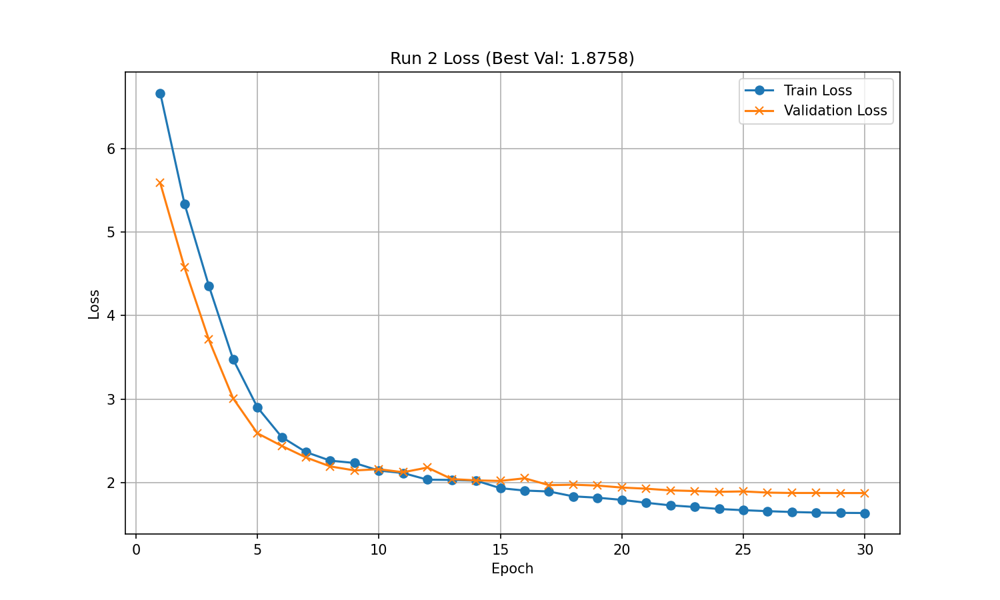
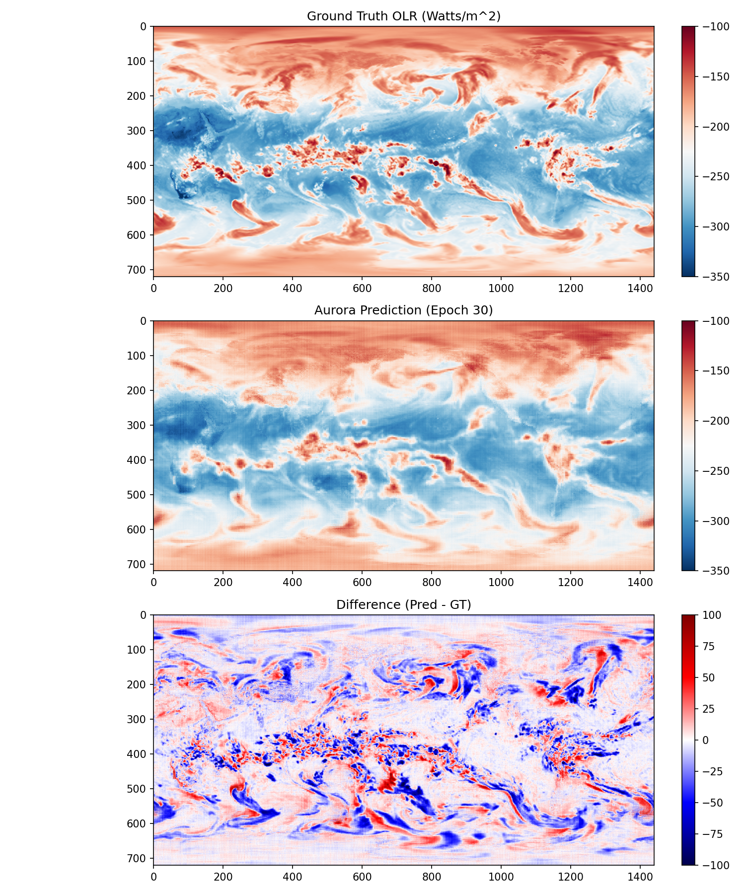

```markdown
# 🌍 Fine-Tuning Aurora for MJO Prediction

[](https://www.python.org/)
[](https://pytorch.org/)
[](https://lugroup.yale.edu)
[]()

> **Adapting the 1.3B Parameter Microsoft Aurora Foundation Model for Sub-seasonal Forecasting of the Madden-Julian Oscillation.**

---

## 📖 Overview

The **Madden-Julian Oscillation (MJO)** is the dominant mode of intra-seasonal variability in the tropical atmosphere, acting as a crucial bridge between medium-range weather and seasonal climate prediction. Traditional Numerical Weather Prediction (NWP) struggles to maintain skill beyond 10-14 days.

This project investigates the efficacy of **Foundation Models** for this task. Unlike traditional statistical approaches that regress on anomalies, we treat MJO forecasting as a **physics-consistent initial value problem**. By fine-tuning **Microsoft Aurora**—a 3D Swin Transformer pre-trained on petabytes of atmospheric data—we aim to extend skillful MJO prediction out to 30+ days.

### Key Objectives
1.  **Engineering:** Build a robust HPC pipeline to fine-tune billion-parameter models on the Yale Grace Cluster using A100 GPUs.
2.  **Methodology:** Pivot from statistical emulation (anomaly mapping) to prognostic simulation (raw physical state stepping).
3.  **Performance:** Achieve an RMM Index correlation of $r > 0.5$ at a 30-day lead time.

---

## 🧪 Methodology & Pipeline

We utilize a two-stage fine-tuning approach (Full-Model Adaptation followed by **LoRA** Rollouts) to adapt Aurora to the specific dynamics of the tropics.

### The "Physics-First" Data Strategy
We identified that Foundation Models require absolute physical consistency. We engineered a pipeline to ingest raw **ERA5 Reanalysis** data (0.25° Global, 6-hourly), extending the model's embedding space to include MJO-critical variables:
*   **Outgoing Longwave Radiation (OLR):** A proxy for tropical convection.
*   **Total Column Water Vapor (TCWV):** Capturing "moisture mode" dynamics.

### HPC Optimization
Training a 1.3B parameter model on high-resolution global grids requires aggressive optimization. Our pipeline implements:
*   ⚡ **Gradient Checkpointing:** To trade compute for VRAM.
*   📉 **Mixed Precision (BFloat16):** For stability and memory efficiency on Ampere GPUs.
*   🔄 **Lazy Data Loading:** A custom `xarray` + `dask` implementation to stream Terabyte-scale datasets.

---

## 📊 Preliminary Results

*Early validation runs (Micro-Fine-Tuning on Jan 2015) demonstrate strong convergence and the ability to capture tropical convective structures.*

| Training Dynamics | Physical Fidelity |
| :---: | :---: |
|  |  |
| *Validation loss decreases consistently, proving generalization.* | *Top: Ground Truth OLR. Middle: Aurora Prediction.* |


---

## 👥 The Team

This work is conducted at **Yale University** as part of the **Lu Research Group** (Scientific Machine Learning).

*   **Principal Investigator:** [Prof. Lu Lu](https://lugroup.yale.edu)
*   **Research Team:**
    *   [Kieran A. Malandain](https://www.linkedin.com/in/kieran-malandain/) (Yale '26)
    *   Dr. Sifan Wang (Postdoctoral Associate)
    *   Andrew Xu (Yale '28)

---

## 🚀 Getting Started

### Prerequisites
*   Access to a SLURM-based HPC (e.g., Yale Grace) with NVIDIA A100 GPUs.
*   Conda / Mamba

### Installation
```bash
# 1. Clone the repository
git clone git@github.com:KieranMalandain/aurora-fine-tuning-mjo.git
cd aurora-fine-tuning-mjo

# 2. Create the environment (includes PyTorch, Aurora, Xarray)
mamba env create -f environment.yml
conda activate aurora_mjo
```

### Running the Pipeline
```bash
# 1. Download ERA5 Data (requires CDS API key)
python scripts/larger_download_era5_sample.py

# 2. Submit Training Job (SLURM)
sbatch slurm_scripts/investigate_finetuning.slurm
```

---

## 📄 References & Papers

*   **Project Paper:** [Find here](docs/papers/aurora-mjo-fall-paper.pdf)---as of December 2025
*   **Aurora:** Bodnar et al., *"Aurora: A Foundation Model for the Earth System"* (arXiv:2405.13063)
*   **LoRA:** Hu et al., *"LoRA: Low-Rank Adaptation of Large Language Models"* (ICLR 2022)

---

*Last Updated: January 2026*
```