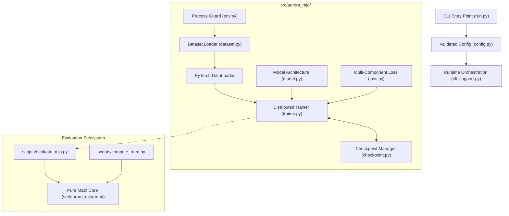

# System Architecture: Aurora MJO Fine-Tuning

**Status:** Authoritative Architectural Design  
**Package Name:** `aurora_mjo` (located at `src/aurora_mjo/`)  
**CLI Entry Point:** `run.py`  

---

## 1. System Overview

This repository adapts the **Microsoft Aurora** 1.3B Earth-system foundation model for sub-seasonal forecasting of the Madden–Julian Oscillation (MJO). The pipeline is structured around a single, cohesive processing spine:



Execution is driven from the top down:
1. `run.py` initiates execution, parsing CLI options and invoking `src/aurora_mjo/env.py` to lock down environment safety.
2. `src/aurora_mjo/config.py` merges `configs/unified.yaml` with mode overlays and dot-notation overrides, validating the configuration through a strict Pydantic v2 schema.
3. `dataset.py` streams 6-hourly ERA5 reanalyses from CFS via verified per-variable timestamp alignment maps.
4. `model.py` loads the pretrained Aurora backbone, injects optional LoRA adapters, freezes backbone weights, and wraps prognostic outputs.
5. `loss.py` applies tropical-weighted L1, spectral regularization, and optional moisture-budget physics constraints across rollout horizons.
6. `trainer.py` executes multi-GPU distributed data parallel (DDP) training, protected by collective gradient finiteness guards and SLURM preemption signal traps.
7. `checkpoint.py` ensures atomic, rank-0 checkpoint persistence and state resumption.

---

## 2. The Core Processing Spine

### 2.1 Process Startup & Environment Guard (`env.py`)
- **Responsibility:** Configures environment variables before C-libraries (`netCDF4`, `HDF5`) initialize.
- **Key Function:** `configure_environment()` sets `HDF5_USE_FILE_LOCKING=FALSE` if unset to prevent Lustre advisory locking errors (`[Errno -101]`) on CFS.
- **Custom Error:** Defines `StaticVarLoadError` for loud, unmasked failures during invariant tensor loading.

### 2.2 Boundary Configuration Validation (`config.py`)
- **Responsibility:** Ingests YAML dictionaries and CLI flags, producing an immutable, strongly-typed `Config` object.
- **Schema Enforcement:** Configured with `extra="forbid"`, rejecting typos such as `--override training.optimzer.lr=1e-5`.
- **Validity Matrix:** Enforces physical and hardware constraints at process boundary:
  - Gradient checkpointing strictly forbidden (`gradient_checkpointing: false`).
  - Chronological dataset splits strictly enforced (train, val, test must be disjoint).
  - MSL normalisation stats required (`model.norm_stats.msl`).
  - Rollout curriculum bounds validated (`start_steps <= max_steps`).

### 2.3 Dataset Pipeline (`dataset.py`)
- **Responsibility:** Ingests 1° ERA5 NetCDF files from CFS, validates coordinates, aligns multi-variable timelines, injects static invariant fields, and upsamples inputs to 0.25° (`720 × 1440`).
- **Timestamp Alignment:** Replaces brittle file globs with per-variable timestamp index dictionaries. The global sample timeline is the exact sorted intersection of all 11 variable timelines, strictly pruned to `[start_year, end_year]`.
- **Static Variables:** Loads surface geopotential (`z`), land-sea mask (`lsm`), and soil type (`slt`). Hard-fails with `StaticVarLoadError` if files cannot be read.

### 2.4 Model Architecture & Adaptation (`model.py`)
- **Responsibility:** Instantiates the Aurora Swin Transformer backbone (`AuroraSmallPretrained` or `Aurora`), initializes custom projection heads (`AuroraMJO`), and manages LoRA parameter adaptation.
- **Freezing Strategy:** Freezes the 1.3B-parameter backbone, leaving only trainable LoRA adapters and/or MJO projection heads active (typically 41k–82k trainable parameters).
- **Renormalisation Hooks:** Injects custom `locations` and `scales` into Aurora's normalisation dict to accommodate the surface pressure (`ps`) proxy in place of MSL.

### 2.5 Multi-Component Loss Functions (`loss.py`)
- **Responsibility:** Computes gridded and phase-space losses across autoregressive rollout steps.
- **Loss Terms:**
  - `TropicalWeightedL1Loss`: Latitude-weighted L1 grid loss emphasizing the tropical equatorial band (15°S–15°N).
  - `SpectralLoss`: FFT-based loss penalizing spatial distortion in high wavenumbers.
  - `MoistureBudgetLoss`: Physics-informed regularization enforcing atmospheric moisture conservation:
    $$\frac{\partial \text{PW}}{\partial t} \approx E - P - \nabla \cdot \mathbf{Q}$$
  - `MJOHeadLoss`: Mean squared error on RMM1 and RMM2 predictions.

### 2.6 Distributed Trainer (`trainer.py`)
- **Responsibility:** Coordinates training and validation loops under PyTorch Distributed Data Parallel (DDP).
- **Gradient Guard (Lesson 2):** PyTorch's `GradScaler` is inactive under bfloat16. `trainer.py` enforces a collective `_collective_all_finite()` check across all DDP ranks before stepping the optimizer. If non-finite gradients occur, the step is skipped collectively, preserving Adam's moment buffers.
- **SLURM Signal Handling:** Catches `SIGUSR1` 30 minutes prior to walltime expiration, saves an emergency resumption checkpoint, and exits with code 99 to signal auto-resubmission in chained SLURM runs.

### 2.7 Checkpoint Management (`checkpoint.py`)
- **Responsibility:** Manages training checkpoints (`ckpt_epoch_*.pt`, `checkpoint_latest.pt`, `best_model.pt`).
- **Safety:** Rank-0 only writes; atomic writes through temporary files to prevent corrupted checkpoints upon unexpected node termination.

---

## 3. RMM Evaluation Architecture (`src/aurora_mjo/rmm/`)

To preserve modularity and testability, pure mathematical and statistical evaluation routines are separated from filesystem I/O:

- **`src/aurora_mjo/rmm/compute.py`**:
  - `calc_climatology`: Computes day-of-year seasonal cycles on training splits.
  - `remove_climatology`: Removes climatological reference means.
  - `remove_previous_120d_mean`: Computes running-mean anomaly corrections.
  - `lat_band_mean`: Tropical latitude-band averaging (15°S–15°N).
  - `compute_rmm_indices`: Wheeler & Hendon EOF projection and normalisation.
- **`src/aurora_mjo/rmm/evaluate.py`**:
  - `bivariate_acc`: Computes bivariate anomaly correlation coefficients across forecast lead times.
  - `rmse`, `amplitude_error`, `phase_error`: Statistical validation metrics.
  - `project_fields_to_rmm`: Real-time projection of predicted atmospheric fields onto frozen EOF bases.

Executable scripts in `scripts/` (`compute_rmm.py` and `evaluate_mjo.py`) serve as thin CLI wrappers that import these pure functions.

---

## 4. Architectural Invariants

The following rules govern all code modifications in this repository:

### 4.1 Layout Rule: `src/` vs. `scripts/`
- **`src/aurora_mjo/` is imported and tested. Never run directly.**
- **`scripts/` is run directly. Never imported.**
- Business logic belongs in the package. Scripts provide CLI argument parsing and call package library functions.

### 4.2 The Third-Party Name Collision (`aurora` vs. `aurora_mjo`)
`microsoft-aurora` occupies the top-level Python import namespace `aurora`. It is imported across six first-party files:
```python
from aurora import Batch, Metadata
from aurora.model.lora import LoRA, LoRARollout
```
A first-party package named `aurora` would shadow the upstream Microsoft package, causing immediate `ImportError: cannot import name 'Batch'`.

**Invariant:** The first-party package is strictly named `aurora_mjo`, located at `src/aurora_mjo/`.

### 4.3 Deterministic Checkpointing Constraint
Enabling PyTorch gradient checkpointing deterministically triggers an illegal memory access (IMA) in Triton/cuBLAS kernels on Perlmutter NVIDIA A100 GPUs.

**Invariant:** `model.gradient_checkpointing` must remain `false` in all configurations.
